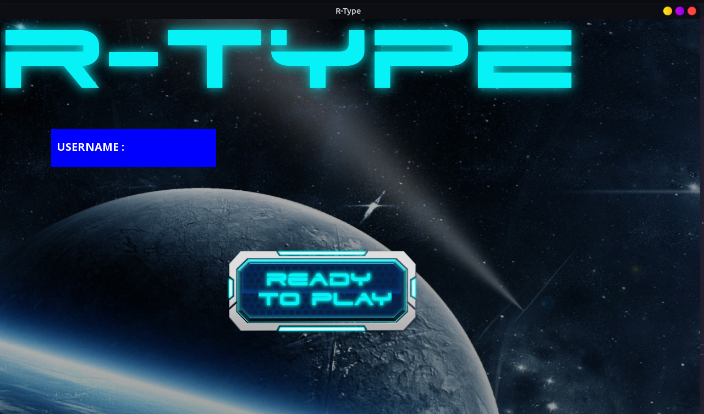

\page tutorial
# Tutorial for R-Type

Welcome to the R-Type tutorial !

Here are some useful examples of how to learn architectures and functions to recreate them.

## Contents

- [Getting Started](#Getting-Started)
- [For developers](#For-developers)

## Getting Started

Begin by setting up your development environment.
Click [here](https://github.com/EpitechPromo2026/B-CPP-500-LYN-5-1-rtype-bryan.zakka/tree/dev) to learn more about the dependencies and any updates you need to do before running the tutorial.

> Preview of the game

## For developers

First of all, you need to understand what is ECS, the fondation of many video games and as you can guess this R-type.

Entity Component System (ECS) is a software architectural pattern often used in video game development for the representation of game world objects. An ECS comprises entities composed from components of data, with systems which operate on entities' components [link](https://en.wikipedia.org/wiki/Entity_component_system).

In an ECS:

    Entities represent a general-purpose object. In a game engine context, every coarse game object is represented as an entity. Usually, it only consists of a unique id.

    Components label an entity as possessing a particular aspect, and hold the data needed to model that aspect. For example, every game object that can take damage might have a Health component associated with its entity.

    Systems act on all entities with the desired components. For example, a physics system may query for entities having mass, velocity, and position components, and iterate over the results doing physics calculations on the sets of components for each entity .

This can make the game more maintainable and easier to understand, as well as potentially more performant due to the data-oriented design, which is a good fit for modern CPU architectures.

> Client Side :

## Game Loop Client side

    BLABLABLA LOOPS

## Player Controls Client side

    BLABLABLA CONTROLS

> Server Side :

The protocol for the server side can be schematized like that:

## Game Loop Server side

BLABLABLA LOOPS

## Player Controls Server side

BLABLABLA CONTROLS